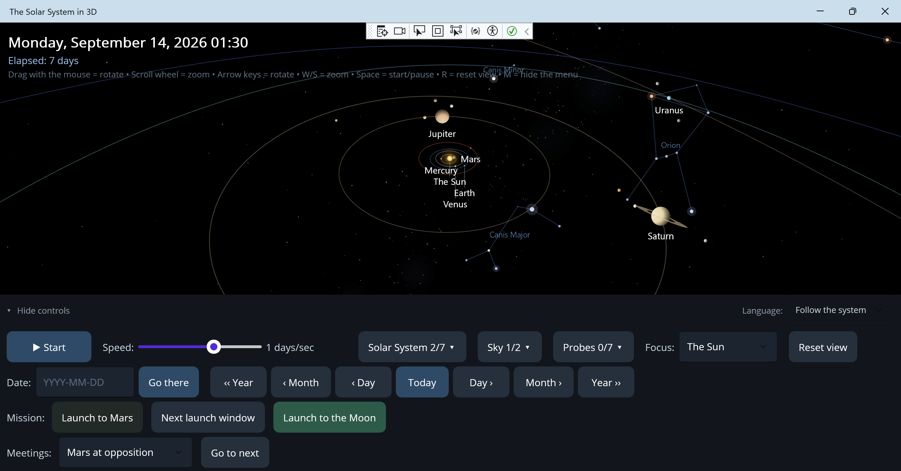

# The Solar System in 3D

A .NET MAUI desktop app (Windows) that shows the Solar System in 3D – built
for teaching, so students can see how the planets move around the Sun.



## Features

- **Real orbits**: the eight planets plus the dwarf planet Pluto follow
  Keplerian ellipses with real eccentricity, inclination and orbital period.
  Starting positions are computed from orbital elements at epoch J2000, so
  the positions roughly match reality for the simulated date. Pluto's orbit
  is a good contrast to the planets': 17° inclination, a 248-year period, and
  so eccentric that it dips inside Neptune's orbit at times.
- **The Moon's orbital plane and its nodes**: a checkbox draws the Moon's
  orbit against the ecliptic, with the two nodes marked – the points where
  the orbit crosses Earth's orbital plane. This is what the whole eclipse
  question hinges on: the Moon goes around time after time without anything
  happening, because its orbit is tilted 5.1 degrees and the Moon therefore
  passes above or below the Sun. Only when the Sun happens to stand near the
  node line can the three line up. The node line also turns backward once
  every 18.6 years, and because the app accounts for that motion, seventeen
  of eighteen real solar eclipses between 1999 and 2030 land on the correct
  calendar day.
- **Eclipses**: the meeting picker finds the next solar or lunar eclipse and
  jumps there. The dates are computed forward, not looked up: all ten solar
  eclipses between 2024 and 2028 come out in the right order from the model,
  and the 6,585-day Saros period falls out on its own. On the jump, the
  Moon's orbit is switched on and the camera moves to Earth, so you see the
  Sun standing on the node line that very day – the explanation for why it's
  an eclipse this time and not on the other twelve new moons of the year.
  What the app does not show is whether the eclipse is total or partial and
  where on Earth it's visible; that depends on where the observer stands on
  the globe, and the app sees the Solar System from outside.
- **The heliopause**: the edge of the Solar System, 120 AU out, where the
  solar wind meets the interstellar medium. It's drawn as a transparent
  sphere once you've zoomed out far enough – easiest by picking one of the
  Voyager probes in the focus selector. Their crossings on 25 August 2012 and
  5 November 2018 are marked as milestones, and are the only two times any
  spacecraft from Earth has crossed the boundary. That the two crossed at
  121.6 and 119.0 AU respectively says something in itself: the edge isn't a
  sphere. The Solar System travels through the interstellar medium at 25
  km/s and gets a bow shock ahead of it, so the boundary sits closer in the
  direction we're heading.
- **Meetings in the sky**: a selector in the control panel finds the next
  opposition or conjunction and jumps there. Opposition is when Earth passes
  between the Sun and an outer planet – it then stands closest and is
  visible all night. Conjunction is when two planets stand in the same
  direction as seen from here, like Jupiter and Saturn on 21 December 2020,
  when they came within a tenth of a degree of each other. The distance is
  shown too, since Mars oppositions differ by almost a factor of two: 0.38 AU
  on a favourable occasion versus 0.68 on an unfavourable one.
- **Surfaces and rotation**: bodies with a surface map are drawn as globes
  once you've zoomed in enough, with real axial tilt and real rotation
  period. Earth has its continents and turns once per sidereal day, so the
  right continent faces the Sun at the right time. Mars has its dark albedo
  features – Syrtis Major is the triangle Huygens drew in 1659 and timed to
  measure the planet's day – plus polar caps and Valles Marineris as a
  streak. A Martian day is 24h 37m, only half an hour longer than Earth's,
  and that its solar day is a further two minutes longer falls straight out
  of its orbital motion. Jupiter has its cloud bands at the right latitudes –
  light zones where gas rises, dark belts where it sinks – and the Great Red
  Spot, 16,500 km across and therefore wider than Earth. Jupiter turns once
  every 9h 55m, the fastest in the Solar System despite being the largest, so
  the Spot completes a lap and comes back within ten minutes of playback at
  high speed. Where the Spot sits on a given date is, however, not modelled:
  it drifts a full turn in just under four years, irregularly. Saturn has the
  same kind of bands but much fainter – haze higher up blurs them out – and
  around the north pole the hexagon, the jet stream with six straight sides
  that Voyager discovered in 1980 and that has no counterpart anywhere else
  in the Solar System. Uranus is the smooth one: methane swallows red light
  and leaves an almost featureless blue-green globe, and since its axis lies
  only 8° from its orbital plane the planet rolls rather than spins – the Sun
  wanders between 82° south and 82° north over its 84-year orbit. Neptune is
  a deeper blue and has weather: the Great Dark Spot that Voyager 2 saw in
  1989, roughly Earth-sized, with its white companion cloud. Mercury is grey
  and heavily cratered, so similar to the Moon that photos are hard to tell
  apart, with Caloris – 1,550 km across, a quarter of the planet's
  circumference – as its clearest feature. It rotates three times for every
  two of its years, so a day there lasts two years. Venus shows none of its
  surface, only an even yellow-white cloud deck with the faint streaks
  visible in ultraviolet light, and rotates backwards over 243 days – longer
  than its 225-day year. A solar day on Venus is therefore only 117 days,
  shorter than either, because the surface moves to meet the Sun. The Moon
  has its maria – lava plains, not water – with Mare Tranquillitatis where
  Apollo 11 landed, and Tycho's ray system. It's tidally locked: one turn on
  its axis per orbit around Earth, so the same side always faces us, and the
  far side lacks maria. Pluto shows Tombaugh Regio, the bright heart of
  frozen nitrogen that New Horizons photographed in 2015, turned away from
  Charon exactly as in reality. The four Galilean moons each have their own
  face: Io sulphur-yellow with red volcanic rings and not a single crater,
  because the surface is remade faster than impacts can leave marks; Europa
  nearly white ice crossed by reddish-brown cracks; Ganymede grey-brown in a
  patchwork of old and new terrain, and larger than Mercury; Callisto dark
  and saturated with craters, with Valhalla, the scar of an impact 3,800 km
  across. All four are tidally locked and keep the same face toward Jupiter.
  Titan deliberately shows nothing at all – the haze is opaque, just like
  Venus's clouds.
- **Moons**: 15 moons orbit their planets with real orbital elements and are
  shown once you zoom in – Earth's Moon, Mars's Phobos and Deimos, Jupiter's
  four Galilean moons, Saturn's Enceladus, Rhea and Titan, Uranus's Miranda,
  Titania and Oberon, Neptune's Triton, and Pluto's Charon. Titan is larger
  than Mercury, and Enceladus is the brightest body in the Solar System.
  Five of the moons orbit **retrograde**, i.e. opposite to everything else:
  Uranus's three (the planet lies on its side), Charon (Pluto rotates
  backwards), and above all Triton, which is almost certainly a captured
  dwarf planet from the Kuiper belt. Phobos completes an orbit in 7.7 hours –
  faster than Mars spins on its own axis. The Jupiter moons' phase angles are
  chosen so that the Laplace resonance holds: Io, Europa and Ganymede have
  orbital periods in the ratio 1:2:4 and can therefore never line up at once
  – when Io and Europa meet, Ganymede is always 90° away. The moon systems'
  geometry follows the planets' magnification, so the distances stay right
  relative to the planet; the system is compressed only when needed – when
  the innermost moon would otherwise land more than 3 planet radii out (our
  own Moon sits at 60) or the outermost more than 10 (Callisto sits at 27
  Jupiter radii). A moon is never pushed closer than 2.5 planet radii, so
  Enceladus stays outside Saturn's rings. In "Real size" mode, true geometry
  is used throughout. Picking a planet in the focus selector zooms the
  camera so its whole moon system fits in frame.
- **The double planet Pluto–Charon**: Charon has half of Pluto's diameter and
  an eighth of its mass, so the pair's common centre of mass lands 2,126 km
  from Pluto's centre – outside Pluto itself, which has a radius of
  1,188 km. The app therefore treats the Kepler orbit as the centre of
  mass's orbit and lets Pluto wobble around it instead of standing still.
  Earth and the Moon have the same effect but much weaker: that centre of
  mass lies inside Earth. Charon also orbits retrograde, because Pluto
  itself rotates the "wrong" way.
- **Rings around all four giant planets** – not just Saturn. The radii are
  real: Jupiter's thin dust ring (122,500–129,000 km), Saturn's broad icy
  rings (74,700–136,800 km), Uranus's narrow, coal-dark rings
  (38,000–51,150 km) and Neptune's faint rings out to the Adams ring
  (41,900–62,933 km). The rings lie in the planet's equatorial plane, the
  same plane the moons use, so Uranus's rings stand on edge – 82° to the
  ecliptic. Saturn's rings are visible even in the overview, while the other
  three are so faint they were only discovered by space probes and so are
  only drawn once you've zoomed in properly.
- **Trip to Mars**: the "Launch to Mars" button sends a spacecraft from
  Earth's position on the date the view is standing on. The craft then
  follows its transfer orbit without steering, exactly like a real probe
  between the rocket engine's two brief burns. The distance already covered
  is drawn brighter than what remains.

  The orbit is basically a Hohmann transfer – the most fuel-efficient path –
  but such a transfer can only reach points exactly 180° away, and right
  there the orbital plane becomes undefined: Mars sits 1.85° out of the
  ecliptic and is almost never exactly antiparallel to Earth. So the orbit is
  instead solved from its boundary conditions with a Lambert solver, which
  gives the orbit that goes from Earth's position on launch day to Mars's
  position on arrival day. The rendezvous lands within a few thousandths of
  an AU, comfortably inside Mars's radius of 3,390 km.

  The travel time is chosen to make the launch as cheap as possible, measured
  as the speed the craft needs relative to Earth when it departs. That comes
  out around 3 km/s, which is also what real Mars missions cost. The
  cheapest orbit sweeps around 200° instead of exactly 180 – a bit more than
  half a turn, since Mars needs time to arrive at the rendezvous – and the
  travel time is 294 days in the autumn 2026 window, arriving in August 2027.

  On arrival, the craft travels along with the planet instead of staying put
  where Mars happened to be – a real probe does enter orbit or land, after
  all. The label changes to "Craft has arrived".

  **Launch windows**: the button is only active when a fuel-efficient trip is
  actually possible, and "Next launch window" jumps forward to the next
  opportunity. The requirement is that the launch costs at most 0.1 km/s more
  than the window's very best day. That gives windows of 11–34 days recurring
  every 780 days, exactly as in reality: the five nearest fall in October
  2026, November 2028, January 2031, March 2033 and June 2035, the same
  rhythm as real Mars windows. That's why Mars missions always launch in
  clusters – in summer 2020 the US, China and the United Arab Emirates each
  sent a probe within two weeks of each other, and then nothing happened for
  two years.

  The measure is deliberately relative rather than a fixed km/s limit, since
  windows vary in quality: the cheapest opportunity swings between 2.90 and
  3.20 km/s depending on where Mars sits in its eccentric orbit. Travel time
  varies even more, between 178 and 318 days, since sometimes the short way
  is just under half a turn and cheapest, sometimes the long way just over.
  The textbook's 259 days and 44° phase angle apply to circular orbits;
  reality's values swing around them.
- **Trip to the Moon**: the "Launch to the Moon" button sends a spacecraft
  from a low orbit 400 km up, and the view jumps to Earth at the same time –
  the whole trip fits within 0.003 AU and would otherwise be less than a
  pixel. Here the craft orbits Earth instead of the Sun: the same ellipse and
  the same Kepler equation, but with Earth's gravitational parameter, which
  is 330,000 times smaller than the Sun's.

  Travel time is three days, as with Apollo. A pure Hohmann orbit out to the
  Moon would take 4.95 days, so the craft must be launched faster than that:
  the orbit's far end lands 440,000–630,000 km out, well beyond the Moon, and
  the Moon is caught up with on the way out – before the turning point.
  Launch speed comes out to 10.84 km/s, exactly as in reality, and speed has
  dropped below 1 km/s by arrival.

  The big difference from Mars is that the launch can happen on any day.
  From an orbit, the craft can depart in any direction, so the launch point
  is chosen so the orbit meets the Moon – and the Moon is back in the same
  spot every 27 days besides. No launch windows are needed.
- **Mission panel and arrival**: while a craft is under way, elapsed travel
  time, time remaining, distance to target and speed are all shown. Speed is
  the interesting line: it falls the whole way, exactly as Kepler's second
  law says – toward Mars from 33.1 to 20.5 km/s, toward the Moon from 10.8 to
  0.6 km/s. Distance to the Moon shrinks the whole way, but the distance to
  Mars *grows* at first, from 246 to 409 million km, before it falls. The
  craft is going around the Sun, not straight at the planet, and Mars stands
  on the far side of the Sun when the trip begins.

  On arrival, the camera locks onto the craft and zooms in on the target, so
  you see it arrive. This happens once, at the moment of arrival itself –
  after that you steer freely again, and a new choice in the focus selector
  or "Reset view" releases the lock.
- **The five spacecraft** on their way out of the Solar System – Voyager 1
  and 2, Pioneer 10 and 11, and New Horizons – with trails behind them. They
  aren't entered as orbital elements but built from their real dates: each
  leg of the journey is the orbit that goes from one planet to the next in
  exactly the time the flyby took, computed from the app's own planet
  positions. The probes therefore land at the right planet on the right day
  on their own – the worst of the eleven flybys is off by 602 km at Neptune,
  two hundredths of a planet radius, and New Horizons meets Pluto within
  319 km.

  The final leg runs out to the probe's known position today, and that
  makes its inclination out of the ecliptic a result rather than an input:
  +35.6° for Voyager 1 and −47.9° for Voyager 2, against the accepted 35° and
  48°. Tilt the camera and you see immediately that they left the Solar
  System's disc in opposite directions. Today they sit at 169 and 142 AU
  with speeds of 16.7 and 15.0 km/s (NASA's figures: 167 and 140 AU, 17.0 and
  15.4 km/s). Pioneer 10 and 11 stay close to the ecliptic, at 142 and 120
  AU, and New Horizons has reached 65 AU. Pioneer 10 went silent in 2003 and
  Pioneer 11 already in 1995, so their positions are calculated rather than
  measured.

  The gravity assists follow for free, since the legs meet at the same
  position but with different speeds: Jupiter gave Voyager 1 a full 10.8
  km/s and Pioneer 10 as much as 12.1. At Neptune, Voyager 2 was instead
  *slowed* by 2.3 km/s, the price for swinging down toward the moon Triton,
  and at Pluto essentially nothing happens to New Horizons – Pluto is too
  small to sling anything.

  The shape of the orbits tells the same story: the probes' first leg, from
  Earth to Jupiter, is an ellipse while everything after Jupiter is a
  hyperbola. It was Jupiter, then, that gave them speed enough to never come
  back. Two exceptions exist. Pioneer 11 was slung by Jupiter not outward but
  inward and across the Solar System – the orbit falls in to 3.8 AU, goes
  half a turn around the Sun and climbs out to Saturn, eleven degrees above
  the ecliptic – and only Saturn gave it speed enough to leave. New Horizons
  is the opposite exception: it was on a hyperbola from launch itself, the
  fastest ever flown, and passed the Moon's orbit after nine hours against
  Apollo's three days.

  The Pluto flyby in 2015 is also proof that the orbits are computed in
  three dimensions. Pluto stood 1.10 AU outside the ecliptic plane at the
  time – more than Earth's own orbital radius – and New Horizons meets it
  there, not in the plane.

  **Milestones and panel**: launch and every planetary flyby are marked with
  a ring along the trail, with the year. Picking a probe in the focus
  selector gives it full labels – planet, month and speed change – and a
  panel shows distance, speed, what the last flyby gave, and when the next
  one occurs. Speed is the line to watch: it jumps at every flyby and then
  slowly falls as the probe climbs out of the Sun's gravity. Voyager 1 goes
  from 27.4 km/s after launch to 20.4 at Saturn in 1982, 17.7 in 1990 and
  16.67 today, and the curve flattens out.

  **Choosing probes**: the probes are off by default – they're a deeper
  layer, and their trails cross the whole view, so the overview starts
  clean. The "Probes" button unfolds a panel where each probe is checked
  individually, so you can show just Voyager 1, or both Voyager probes to
  compare their opposite paths out of the ecliptic, without the others
  getting in the way. The choice covers dot, trail and milestones, and the
  two orbiting probes share the same list. Turning off the probe the camera
  is following drops focus back to the Sun and the view zooms out to the
  overview.

  **Scale**: picking a probe makes the probe what the camera orbits, and the
  camera positions itself at 2.4 times the probe's distance from the Sun.
  That puts the Sun at most 25 degrees from the centre of frame and so
  keeps it in view no matter how you turn and tilt the camera – with the
  whole planetary system shrunk to a dot around it. That's the point in
  itself: Voyager 1 is 167 times farther out than Earth and four times
  farther than Neptune.
- **Orbiting probes**: Cassini at Saturn (2004–2017) and Juno at Jupiter
  (2016–2026) are drawn with their full orbital ellipse around the planet.
  Juno's end date is the last confirmed contact, not a mission end – the
  probe flew long past the extended mission's planned end, and the app draws
  it for as long as there's evidence it was there. These are simpler cases
  than the five that left the Solar System – plain ellipses – but the orbits
  are also of a different kind: representative rather than reconstructed.
  Cassini flew nearly three hundred different laps, so size, shape, period
  and orbital plane are real while the probe's position in the orbit on a
  given date is not.

  The contrast between the two is the point. Cassini's lap takes 16 days and
  tilts 20° to the ring plane; Juno's takes 53 days and goes straight over
  the poles, unlike the moons, which lie in the equatorial plane. Juno's
  orbit is also extreme: down to 1.08 Jupiter radii, just a few thousand
  kilometres above the cloud tops, and back out to 116 radii. Speed varies
  accordingly, between 57.7 km/s at closest approach – making Juno the
  fastest object humanity has ever sent relative to a planet – and 0.54 km/s
  at its farthest.

  The orbits are compressed with the same factor as the moon orbits, so
  proportions hold: Cassini's lap is almost exactly the same size as Titan's
  orbit, and Juno's stretches more than four times farther out than
  Callisto. Pick Saturn or Jupiter in the focus selector at a date within the
  mission period to see them.
- **True-to-scale distances**: distances between orbits are always to scale
  (1 AU = 60 units). Planet sizes are mutually to scale but enlarged so
  they're visible – check **Real size** to see how small the planets
  actually are compared to the distances. The camera scales down with them:
  how close you can get is set by the selected body's drawn radius, so a
  planet can be zoomed in on until it fills the frame in both modes. The
  limit always sits just outside the surface, so you never end up inside the
  body.
- **The asteroid belt** can be switched on with a checkbox (off by default).
  1,400 small bodies between Mars and Jupiter, with the same statistical
  distribution as the real belt: semi-major axes 2.06–3.27 AU, mean
  eccentricity 0.14 and mean inclination 9.5°. Each asteroid follows its own
  Kepler orbit, so the inner part of the belt rotates faster than the outer.
  The **Kirkwood gaps** are left empty – the clear lanes where Jupiter's
  repeated tugging has swept the asteroids away through resonances. The
  dwarf planet **Ceres**, which alone holds a quarter of the belt's mass, is
  drawn with its name on its real orbit.
- **The Kuiper belt** beyond Neptune, also with its own checkbox. 1,100 icy
  bodies in two populations: *plutinos* locked in 3:2 resonance with Neptune
  at 39.4 AU – they complete two laps while Neptune completes three, and
  Pluto itself is one of them – and the *classical belt* between 42 and 47.8
  AU, where it ends abruptly at the "Kuiper Cliff". The inclinations are
  roughly like the asteroid belt's, but since the belt sits sixteen times
  farther out it becomes fifteen times thicker in absolute terms: the bodies
  reach 18 AU up and down against the asteroid belt's 1.2. Tilt the camera
  and zoom out to see the difference clearly.
- **The Sun's rotation and sunspots**: zoom in on the Sun and spots appear.
  They sit in two belts on either side of the equator, between five and
  thirty degrees of latitude, each with a dark core in a lighter halo. A
  large group spans over a hundred thousand kilometres, more than ten
  Earths across, and is 1,500 degrees cooler than the surrounding surface –
  it only looks black by comparison.

  What's worth pausing on is that **the Sun doesn't rotate as one piece**.
  The equator completes a turn in 25 days, the thirtieth parallel in 26.4.
  Two groups fourteen degrees of latitude apart therefore drift apart by a
  third of a turn per year, visible if you step forward month by month. A
  solid body can't do that: it's the proof that the Sun is gas all the way
  through. The rotation is taken from Newton and Nunn's 1951 sunspot
  measurements.

  The Sun's equator tilts 7.25 degrees to the ecliptic, and it shows over the
  year – we see most of the Sun's north pole on 8 September and most of the
  south pole on 6 March. That the model lands on those dates is a check on
  the axis's direction that nothing else in the app tests. The limb
  darkening, that the disc is brighter in the middle than at the edge, is
  also real: at the edge you're looking obliquely into the gas and reach
  only the upper, cooler layers.
- **Halley's Comet**: a checkbox lights up the comet with its orbit and its
  two tails. The orbit is everything the planets' orbits aren't – an
  eccentricity of 0.967 takes it from 0.586 AU at perihelion, inside Venus's
  orbit, out to 35.1 AU at aphelion, beyond Neptune. From that follows the
  speed: 55 km/s near the Sun and 0.9 km/s at the far end. The 162°
  inclination means it's retrograde, moving against the planets' direction
  of travel. The elements are anchored to two known perihelia, 9 February
  1986 and 28 July 2061, and that they check out shows in something the
  model was never told: the comet comes closest to Earth on 10 April 1986 at
  0.416 AU, against reality's 11 April and 0.42.

  There are two tails because there are two in reality, and they differ for
  a reason worth seeing: the ion tail is gas that the solar wind tears
  straight away from the Sun, while the dust tail is grains too heavy to be
  swept along and so trails behind in the orbit. Neither points behind the
  comet in its direction of travel – on the way out from perihelion, Halley
  travels tail-first. And the tail exists only when it should: the ice only
  starts vaporizing inside 3 AU, which the comet is for 368 days out of its
  27,563.

  The meeting picker has gained **"Halley at perihelion"**, which jumps to
  the next lap and lights up the comet on the way. What's reported isn't the
  distance to the Sun – that's 0.586 AU every time, which is what a
  perihelion is – but what the visit looks like from here. That's where the
  difference between a poor and a good visit shows: on 9 February 1986,
  Halley stood 1.55 AU from Earth and eight degrees from the Sun in the sky,
  right in the daylight, and wasn't anything to see until two months later.
  On 28 July 2061 it stands 0.48 AU away and twenty degrees from the Sun.
  1986 was the worst visit in two thousand years and 2061 will be one of the
  best, and the model works out both without ever having been told.
- **Show/hide moons**: a checkbox toggles all planets' moons at once, for a
  cleaner overview.
- **Start/pause** the rotation (button or spacebar) and adjustable speed
  (0.1–1000 days per second).
- **Clock and date control**: simulated date (year-month-day, hour:minute)
  plus elapsed time, so you can, for instance, see that Earth completes an
  orbit in 365 days. You can jump to any date by typing it in, step ± day,
  month or year with buttons, and return to now with "Today". The speed
  slider runs both ways: the middle stands still, the right half plays time
  forward and the left backward. The orbit computation works just as well
  backward – checked against the Sun's position all the way back to 1977.
- **Name labels** under every celestial body.
- **Free camera**: drag with the mouse to rotate, scroll wheel/W/S to zoom,
  arrow keys to rotate, R resets the view. With the **Focus** selector, the
  camera can follow a single body: the Sun, a planet, one of the fifteen
  moons, or one of the spacecraft. Moons are listed under their planet, and
  picking one zooms the camera in so the moon fills the frame – that's how
  you see Io's volcanoes or Europa's cracks. Moons are only listed while
  shown, and turning them off while the camera follows one drops focus back
  to the Sun.
- **A real night sky**: 225 of the sky's brightest stars with real
  coordinates (epoch J2000), real apparent magnitude and real colour
  (computed from the B-V colour index, so Betelgeuse is red and Rigel
  blue-white). 27 constellations can be shown with figure lines and names –
  Orion, the Big Dipper - Ursa Major, the Southern Cross, Scorpius, and so
  on. The Milky Way runs along the real galactic plane and is brightest
  toward the galactic centre in Sagittarius. Because the stars are converted
  from equatorial to ecliptic coordinates, they land correctly relative to
  the planetary orbits: the planets move through the zodiac constellations,
  exactly as in reality. The **Stars** selector controls density: "None"
  turns off the whole night sky for a fully black background – useful when
  students should focus only on the Solar System – while "Few" shows just
  the catalogue's real stars, and "Normal" and "Many" add background stars
  and the Milky Way.

Performance: the sky sits at infinite distance, so all screen positions are
cached and only recomputed when the camera rotates – zoom and planet motion
don't touch it. Orbit screen shapes are cached the same way, all colours are
precomputed, and anything off-screen is skipped. The app renders at 30
frames/second and skips redrawing entirely while paused with the camera
still.

## Building and running

Requirements: the .NET 10 SDK, the ".NET Multi-platform App UI development"
workload (installed via the Visual Studio Installer, or `dotnet workload
install maui` from the command line), and Windows – see *Platform* below.

Open `Solarsystem.sln` in Visual Studio and press F5, or from the command
line:

```
dotnet build Solarsystem.csproj
dotnet run --project Solarsystem.csproj -f net10.0-windows10.0.19041.0
```

## Downloading a ready-made copy

Under [Releases](https://github.com/KristerH/Solarsystem/releases) there is an
installer, `Solarsystem-<version>-setup.exe`. It contains everything the app
needs, including the .NET runtime, so nothing has to be installed first. It
installs for the current user by default and therefore does not ask for an
administrator password; an administrator can choose to install it for everyone
in the first dialog.

**Windows will warn you the first time you run it.** A blue box appears saying
"Windows protected your PC"; click *More info* and then *Run anyway*. The
warning is not about the app misbehaving. It appears because the installer is
not signed with a code-signing certificate, and those cost a few hundred euro a
year and now require the key to be held on hardware or in a signing service --
which is more than a teaching app written in spare time can carry. The
alternative would have been a self-signed certificate, but that produces exactly
the same warning while looking as though something had been done about it. So it
is unsigned, and this paragraph is here instead.

If you would rather not click past a security warning -- which is a reasonable
position, and the same one this app tries to teach -- build it from source
instead, as described above. That is the same program, assembled on your own
machine.

Uninstall from Settings > Apps, or from the Start menu group. The app writes no
settings and touches no registry keys of its own, and its only file outside the
install folder is an error log in the temp directory, so the uninstall leaves
nothing behind.

## Making a release

Two commands from the repository root, on Windows, with
[Inno Setup 6](https://jrsoftware.org/isdl.php) installed. Note that its
compiler is not added to the path by either installer: the official one puts
`ISCC.exe` in `C:\Program Files (x86)\Inno Setup 6\`, and
`winget install JRSoftware.InnoSetup` puts it in
`%LOCALAPPDATA%\Programs\Inno Setup 6\`. Call it by full path, or add the
directory to your path first.

```
dotnet publish Solarsystem.csproj -f net10.0-windows10.0.19041.0 -c Release -p:RuntimeIdentifier=win-x64 --self-contained true
iscc Installer\Solarsystem.iss
```

The first produces about 230 MB across some 600 files in
`bin\Release\net10.0-windows10.0.19041.0\win-x64\publish\` -- large because
the whole runtime is in there, which is the point. The second compresses that
into a single `Installer\Output\Solarsystem-<version>-setup.exe` of about
58 MB, which is the file people download. Neither output is committed; both
are gitignored.

The version comes from `ApplicationDisplayVersion` in `Solarsystem.csproj` and
nowhere else -- the installer reads it back out of the built executable, so the
two cannot disagree. To cut a release: raise that number and
`ApplicationVersion` beside it, commit, tag it to match (`git tag v1.0.0`), push
the tag, run the two commands above, and attach the resulting `.exe` to a new
GitHub Release on that tag.

## Platform

Windows only, for now. The project is a .NET MAUI app, which is normally
cross-platform, but only `net10.0-windows10.0.19041.0` is listed in
`Solarsystem.csproj`'s `TargetFrameworks` – the Android, iOS and MacCatalyst
platform folders that the project template generates were removed, since
keeping them would have implied a support that doesn't exist. Nothing in the
simulation or rendering code is Windows-specific, so adding a platform back
is mainly a matter of re-adding its `Platforms/` folder and target framework
and testing the result – untried so far.

## Language

The interface supports Swedish and English; a selector in the control panel
switches at any time, defaulting to the operating system's language. See
`Strings.cs` and `Resources/Strings/AppStrings*.resx`.

## Planned extensions

See [TODO.md](TODO.md) – a staged list for further moons, rings and
asteroid/Kuiper belts, meant to be built and verified one stage at a time.

## Credits

- **Orbital elements** for the planets, dwarf planets and moons are from
  NASA/JPL.
- **Pole directions and rotation periods** (`BodyAxis` constants in
  `Simulation/SolarSystemData.cs`) are from the IAU Working Group on
  Cartographic Coordinates and Rotational Elements.
- **The star catalogue** (`Simulation/StarCatalog.cs`) is drawn from the Yale
  Bright Star Catalogue.
- **Open Sans**, the UI typeface (`Resources/Fonts/`), is licensed under the
  Apache License 2.0 – see [THIRD-PARTY-NOTICES.md](THIRD-PARTY-NOTICES.md).

## License

MIT – see [LICENSE](LICENSE).

## Code overview

- `Simulation/SolarSystemData.cs` – planet data (orbital elements, J2000) and
  Kepler computation of positions.
- `Simulation/BodyAxis.cs` – a body's rotation axis and rotation period. The
  axis is described as an orbital plane (inclination and node), deliberately
  so: the equatorial plane is the same plane the regular moons and rings lie
  in, so a moon can read its planet's axis directly. The north pole follows
  the right-hand rule, so retrograde rotation shows up as an inclination
  above 90°. The class can also describe a body that rotates at different
  speeds at different latitudes – the Sun is the only one.
- `Simulation/SurfaceMap.cs` – surfaces as (latitude, longitude) polygons,
  drawn directly on the globe without texture images. Earth's continents are
  the first map.
- `Simulation/SmallBodyBelt.cs` – the asteroid and Kuiper belts' randomised
  orbits, with precomputed rotation so a position costs one Kepler solve.
- `Simulation/Mission.cs` – plans and computes transfer orbits: to Mars with
  the Lambert solver and the cheapest travel time, to the Moon from a given
  travel time. The same class handles orbits around the Sun and around a
  planet.
- `Simulation/Kepler.cs` – Kepler's equation in its two forms: `E - e·sin E =
  M` for ellipses and `e·sinh H - H = M` for hyperbolas. The latter is needed
  for spacecraft that gained enough speed to never come back.
- `Simulation/Conic.cs` – a conic section built from a state, i.e. a position
  and a velocity at a point in time. Handles both ellipses and hyperbolas,
  and is what describes a probe's orbit between two planetary flybys.
- `Simulation/SkyEvent.cs` – finds the next opposition or conjunction. The
  angles are computed as seen from Earth, not the Sun, which matters: the
  great conjunction of 2020 lands on the right day from Earth but seven
  weeks off heliocentrically.
- `Simulation/SolarSystemData.cs` also contains Halley's Comet, whose orbital
  elements are anchored to two known perihelia rather than taken from an
  ephemeris. A fixed Kepler orbit can't hit them all: the real period varies
  between 74 and 79 years, since Jupiter and Saturn tug at the comet on each
  lap and jets of gas from the heated nucleus give it a further nudge. The
  model matches around 1986 and 2061 but places the 1910 perihelion four
  months off.
- `Simulation/Vec3.cs` – a double-precision vector, for the computations
  where `Vector3` isn't enough. Rendering does fine with single precision,
  but when an orbit is built from a position and a velocity, the energy is
  computed as a difference between two nearly equal numbers, and every
  missing digit is then magnified.
- `Simulation/Lambert.cs` – the orbit that goes from one position to another
  in exactly a given time, solved with universal variables. This is what
  lets the probes be built from real launch and flyby dates instead of from
  entered orbital elements.
- `Simulation/Probe.cs` – a real spacecraft as a chain of legs, where each
  leg is the orbit between two flybys over the time they actually took.
- `Simulation/ProbeData.cs` – the seven probes' data: Voyager 1 and 2,
  Pioneer 10 and 11 and New Horizons with their flyby dates and known
  present-day positions, plus Cassini and Juno with their orbits around
  Saturn and Jupiter.
- `Simulation/Orbiter.cs` – a probe that orbits a planet instead of flying
  past. The orbit is given in planet radii and inclination to the planet's
  equator, so a polar orbit stays polar regardless of how the planet itself
  is tilted.
- `Simulation/StarCatalog.cs` – the star catalogue and constellation
  figures, plus the conversion from equatorial to world coordinates.
- `Rendering/StarSky.cs` – draws stars, constellations and the Milky Way.
- `Rendering/OrbitCamera.cs` – a camera that orbits a target point and
  projects 3D points to the screen.
- `Rendering/SolarSystemDrawable.cs` – draws stars, orbits, the Sun,
  planets (depth-sorted and shaded against the Sun), Saturn's rings and
  labels via MAUI's `GraphicsView`. A body with a surface map is drawn as a
  globe with real axial tilt and rotation once it's grown large enough in
  frame.
- `MainPage.xaml(.cs)` – UI, simulation clock, and mouse/keyboard control.
- `Strings.cs` – the app's texts, looked up from the `.resx` files in
  `Resources/Strings`. English is the neutral, default language; Swedish is
  a satellite resource. A new language is one more `.resx` file, no code
  change.
